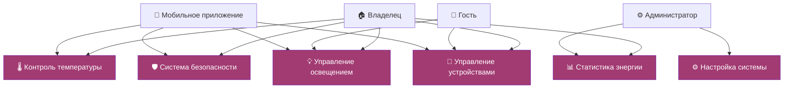

# Диаграмма вариантов использования "Умный дом"

<h1 align="center">

</h1>


## Описание
- **Владелец**: Полный доступ ко всем функциям
- **Гость**: Ограниченный доступ к основным функциям  
- **Администратор**: Настройка системы
- **Мобильное приложение**: Удаленное управление


## Описание кода PlantUML

```PlantUML
!theme materia-outline
top to bottom direction
```
Тема: materia-outline
Направление: top to bottom - компоновка сверху вниз

# Визуальное оформление (skinparam)
```PlantUML
skinparam {
  BackgroundColor White
  ActorBorderColor #2E86AB
  ActorFontColor #2E86AB
  ActorFontStyle bold
  UseCaseBorderColor #A23B72
  UseCaseBackgroundColor #F8F9FA
  UseCaseFontColor #1D3557
  UseCaseFontStyle bold
  RectangleBorderColor #1D3557
  RectangleFontColor #1D3557
  RectangleFontStyle bold
}
```

Задает цвета и стили для всех элементов:
Акторы: синие (#2E86AB)
Стрелки: жирные, контрастные

# Цветовые схемы для категорий
```PlantUML
skinparam usecase {
  BackgroundColor<<climate>> #FFE5EC    # Розовый - климат
  BackgroundColor<<security>> #E2F0CB   # Зеленый - безопасность
  BackgroundColor<<energy>> #FFF2CC     # Желтый - энергия
  BackgroundColor<<control>> #D6EAF8    # Голубой - управление
}
```

# Акторы
```PlantUML
actor "Владелец" as Owner
actor "Гость" as Guest
actor "Администратор" as Admin
actor "Мобильное\nприложение" as Mobile
```
Владелец - основной пользователь
Гость - Временый доступ
Администратор = Настройка системы
Мобильное приложения - Внешная система

# Варианты использования
```PlantUML
rectangle "КЛИМАТ И ОСВЕЩЕНИЕ" <<climate>> {
  usecase "Контроль\nтемпературы" as Temperature
  usecase "Управление\nосвещением" as Lights
  usecase "Сценарии\nклимата" as ClimateScenes
}

```
# Связи между акторами и функциями
```PlantUML
Owner --> Temperature
Owner --> Lights
Owner --> Security
...
```
# Комиты

```PlantUML
note right of Owner
  <b>Владелец</b>
  Основной пользователь
  с полным доступом
end note
```

# Умный дом - Диаграмма использования markdown

