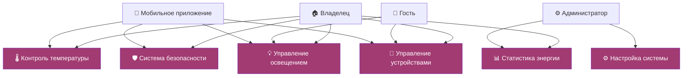

# Диаграмма вариантов использования "Умный дом"

<h1 align="center">

</h1>


## Описание
- **Владелец**: Полный доступ ко всем функциям
- **Гость**: Ограниченный доступ к основным функциям  
- **Администратор**: Настройка системы
- **Мобильное приложение**: Удаленное управление


## Описание кода PlantUML

```PlantUML
!theme materia-outline
top to bottom direction
```


# Умный дом - Диаграмма использования markdown


